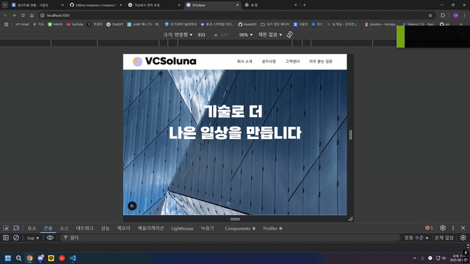

# 가상 회사 사이트

Next.js + TailwindCSS 기반 포트폴리오 웹사이트

## 이미지


상단 바 버튼 클릭 시 새로운 페이지로 이동하며, 특정 뷰포인트에 도달하면 해당 요소에 애니메이션 효과가 적용되도록 구현했습니다.



사이트 전체의 폰트 커스터마이징과 반응형 웹 구현
## 기술 스택

- Framework: Next.js (App Router)
- Language: TypeScript
- Styling: Tailwind CSS

## 폴더 구조

```bash
project-root/
├── app/
├── components/
├── public/
├── styles/
└── ...
